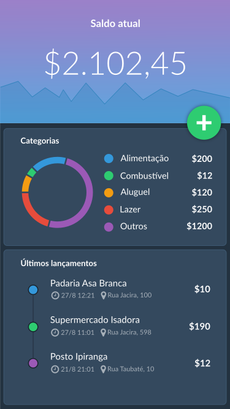
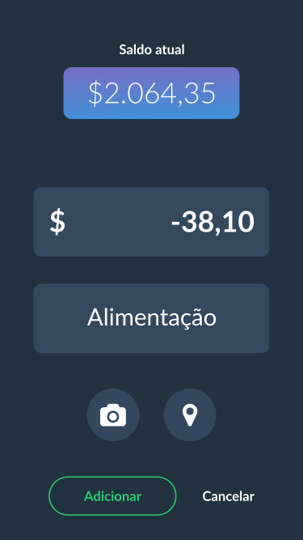
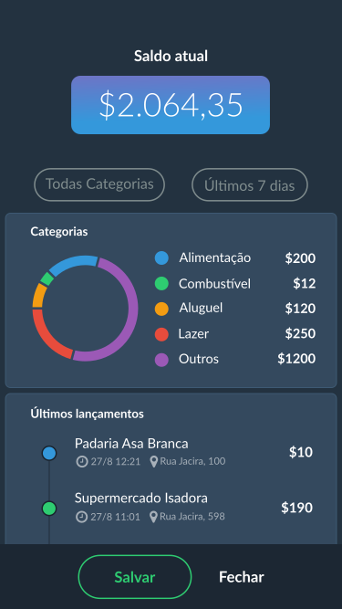

<h1 align="center">
   💰 My Simple Budget - Control your expenses
</h1>

<p align="center">
  

  
  
  
  
  
  
  
</p>

<p align="center">  
  
  
  
</p>

## 💻 Project
A simple expense manager to help you with your finances developed with React Native following Dev Samurai's course.

## :rocket: Technologies

This project was developed with the following technologies:

- [React](https://reactjs.org)
- [React Native](https://facebook.github.io/react-native/)
- [Expo](https://expo.io/)
- [React Native Camera](https://github.com/react-native-community/react-native-camera)
- [React Native Geocoding](https://github.com/marlove/react-native-geocoding)
- [React Native Linear Gradient](https://github.com/react-native-community/react-native-linear-gradient)
- [React Native Masked Text](https://github.com/benhurott/react-native-masked-text)
- [React Native Modal DateTime Picker](https://github.com/mmazzarolo/react-native-modal-datetime-picker)
- [React Native SVG](https://github.com/react-native-community/react-native-svg)
- [React Native SVG Charts](https://github.com/JesperLekland/react-native-svg-charts)
- [React Number Format](https://github.com/s-yadav/react-number-format)
- [Realm](https://github.com/realm/realm-js)
- [UUID](https://github.com/uuidjs/uuid)

### 🧭 Running the Mobile

```bash
# Clone this repository
$ git clone https://github.com/mschneider86/my-simple-budget

# Access the project folder on terminal/prompt
$ cd my-simple-budget

# Install the dependencies
$ npm install ou yarn add

# Start the app
$ yarn start

```

## 🤔 How to contribute

- Fork this repo;
- Create a branch with your feature: 'git checkout -b my-feature';
- Commit your changes: `git commit -m 'feat: My new feature'`;
- Push to your branch: 'git push origin my-feature'.
